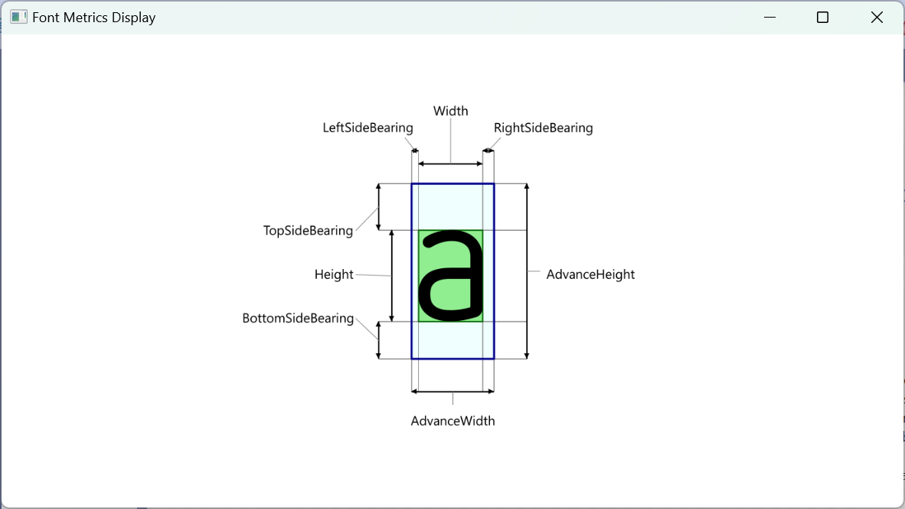

# Display Measurements

This is a simple WPF application that displays a character, annotated with font metrics for that character.

It is useful to a person who is trying to lean how the metrics relate to each other.

Simply run the application and use the keyboard to select which character you wish to display.

Sharing this code as a result of [this conversation](https://github.com/SixLabors/Fonts/discussions/151#discussioncomment-3324276)

